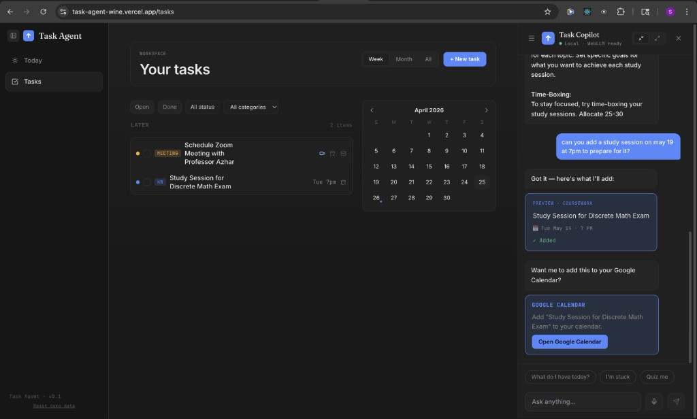

# Task Agent

*A study companion that knows your schedule. Local AI tutor + task manager.* 🤝

[](https://task-agent-wine.vercel.app)
[](./LICENSE)




### Screenshot Spec (for `public/screenshot.png`)

- Capture at desktop size (recommended: 1440x900 or 1920x1080)
- Show the `Today` dashboard and open agent panel in the same frame
- Include one realistic conversation and at least one generated preview card
- Keep visible UI elements: task categories, calendar widget, and floating agent button
- Use neutral sample data (no personal emails, phone numbers, or private course info)
- Prefer Chrome with clean light conditions and readable contrast
- Export as PNG, name it exactly: `public/screenshot.png`
- Recreate/regenerate guidance is available in `SCREENSHOT_PROMPT.md`

## The Problem

Students already use tools like ChatGPT and Notion, but each has a gap for day-to-day academic life. ChatGPT does not know what a student is actually working on this week, and Notion does not tutor in real time. Paid AI subscriptions can be out of reach for many CUNY students, especially those balancing tuition, work, and family responsibilities. On top of that, privacy matters when academic plans and personal details leave a device.

## The Solution

Task Agent combines local AI tutoring with practical task management in one interface. It runs a local model (WebLLM + Llama 3.2 3B) directly in the browser and supports multi-turn conversation for both learning help and schedule planning. It can connect task workflows to Google Calendar and Gmail through deep links, so users can jump into external tools without full account integration. There are no subscriptions, no API keys, and no cloud inference required for the core AI experience.

Task Agent is designed for working-class students who need useful AI support without monthly fees or data-sharing tradeoffs.

## Features

- Local LLM agent (WebLLM + Llama 3.2 3B) that runs in-browser and is offline-capable after initial model download
- Multi-turn task management through natural conversation
- Tutoring support for academic topics (for example: induction, calculus, and study planning)
- Smart task creation with preview cards for events, coursework, and personal tasks
- Three categories with adaptive UI: Coursework, Event, Personal
- Google Calendar deep-link integration (no OAuth required)
- Gmail compose deep-link integration
- Voice input using the Web Speech API
- Chat history with multiple conversations
- Today dashboard with a focus card
- Tasks page with weekly, monthly, and all views
- Calendar widget with task indicators
- Filter tasks by status and category
- `localStorage` persistence (no backend, no accounts)

## Tech Stack

- React + Vite + JavaScript
- Tailwind CSS
- WebLLM + Llama 3.2 3B for local inference
- Google Calendar / Gmail deep links (no OAuth)
- `localStorage` for client-side persistence
- Lucide React for icons
- date-fns for date handling
- Vercel for deployment

## Architecture

Task Agent is fully client-side and does not use a backend server. The LLM runs in the browser via WebGPU through WebLLM, so user data stays on the device for core agent interactions. External calendar and email actions use deep links rather than OAuth-based API access, which keeps integration lightweight while avoiding account-level permissions.

```text
src/
  components/
    Layout/
    Tasks/
    Today/
    Agent/
  data/
  lib/
  App.jsx
  main.jsx
```

## Local Development

```bash
git clone https://github.com/shanhtetsan/task-agent.git
cd task-agent
npm install
npm run dev
```

Open [http://localhost:5173](http://localhost:5173) in Chrome (WebGPU support required).  
The first load downloads an approximately 2GB Llama model, so initial startup can take a few minutes.

## How to Use

1. Open the app.
2. Click the floating agent button in the bottom-right corner.
3. Type natural messages such as:
   - "I have a meeting with Prof. Liu tomorrow on Zoom"
   - "Help me prepare for my midterm"
4. Confirm preview cards to add tasks.
5. Use Google Calendar and Gmail deep links when you want to extend tasks externally.
6. Toggle the agent panel between sidebar and fullscreen modes.

## Why Local AI

Many CUNY students cannot justify another $20/month subscription for study help. Privacy is also a real concern, especially for families managing sensitive personal and academic information. A local-first model means no rate limits from external APIs, less surveillance risk, and no dependency on cloud accounts for core functionality. Once the model is loaded, the assistant can keep working even without an internet connection.

## Roadmap

- Voice-first conversational input
- Real Google Calendar / Gmail OAuth integration (encrypted and optional)
- Cross-device sync with end-to-end encryption
- Course-specific tutoring with syllabus context
- SMS reminders
- Mobile app

## Built at CUNY

Task Agent was built during the CUNY AI Innovation Challenge 2026 (Tech for Change, AI Software track). It was created by CUNY students for CUNY students, with a focus on accessible and inclusive education.

**Team members:** [Shan Htet San, Dylan Reaves, Yeffery]

## License

MIT License.

## Acknowledgments

- Anthropic for Claude (used during development)
- WebLLM team for in-browser LLM infrastructure
- Meta AI for Llama 3.2 3B
- IBM and CUNY for hosting the AI Innovation Challenge
- Mentors and judges of the CUNY AI Innovation Challenge
